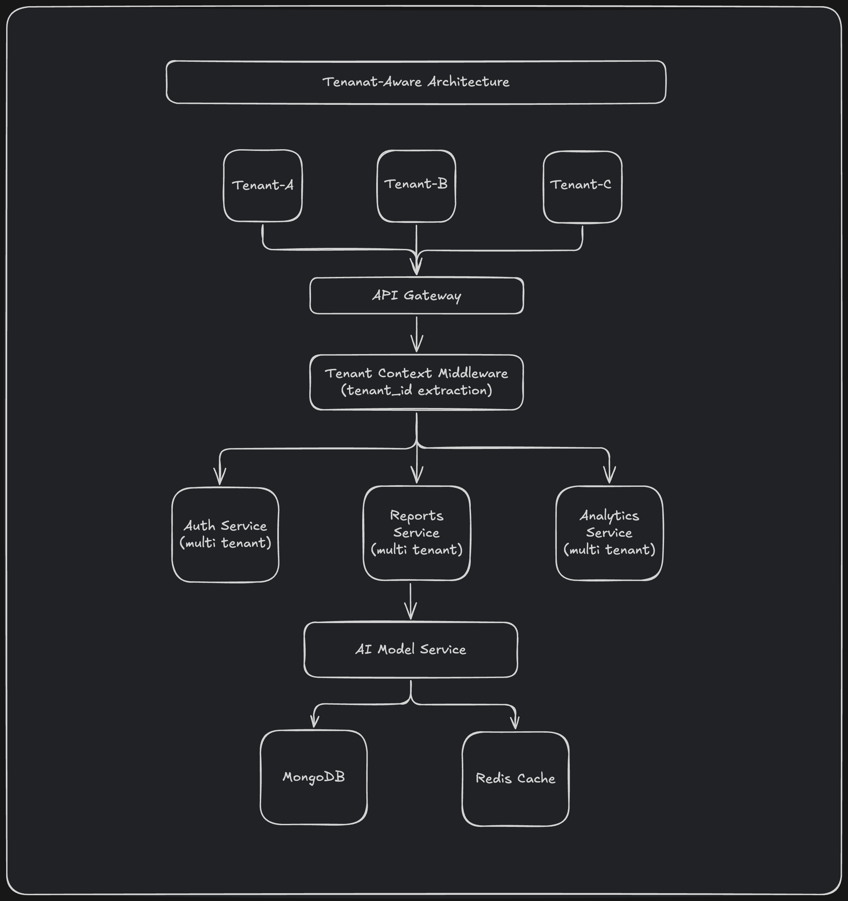

# SafeStreets - AI-Powered Road Damage Detection & Management System

## 🌟 Overview

SafeStreets is an innovative end-to-end solution that revolutionizes road maintenance operations through artificial intelligence and modern technology. The system combines mobile image capture, Vision Transformer (ViT) machine learning models, and intuitive management dashboards to streamline the entire process from damage detection to repair completion.

## 🏗️ System Architecture

The SafeStreets platform consists of five interconnected components:



### Core Components:

1. **📱 Mobile Application** - React Native app for field workers
2. **🧠 AI Model Server** - Flask-based Vision Transformer inference server  
3. **⚙️ Backend API** - Node.js/Express REST API with MongoDB
4. **🖥️ Admin Portal** - React-based web dashboard with Material-UI
5. **📊 Analytics Engine** - Real-time data processing and insights

## ✨ Key Features

- 📷 Advanced road damage detection using AI
- 🤖 AI-powered road damage report summary generation using Google Gemini
- 📍 Automatic GPS location tagging
- 🔐 Secure authentication for administrators and field workers
- 📊 Comprehensive analytics dashboard
- 📝 Task assignment and tracking for repair teams
- 📱 Cross-platform mobile app for field workers
- 🖥️ Feature-rich admin web portal
- 🏢 Multi-tenant architecture for multiple organizations

## 🛠️ Technology Stack

### Core Technologies
- **Frontend**: React.js, React Native, Material-UI, Expo
- **Backend**: Node.js, Express.js, MongoDB, Redis
- **AI/ML**: PyTorch, Vision Transformer (ViT), YOLO, CNN, Flask, Google Gemini
- **Authentication**: JWT, bcryptjs
- **DevOps**: Git, npm/yarn, Nodemon, dotenv

## 🤖 AI Features

### Vision Transformer (ViT) for Image Classification
The system uses a Vision Transformer model to detect and classify road damage from uploaded images into 8 different damage categories.

### CNN-based Road Classification
The platform features a CNN-based road classification service that validates if submitted images contain road surfaces before processing them for damage analysis, ensuring higher quality reports.

### YOLO Object Detection
The system uses YOLO (You Only Look Once) for precise localization of damage areas within road images, providing bounding box information for better visualization and analysis.

### Google Gemini Integration
SafeStreets integrates Google's Gemini 1.5 Flash model to automatically generate professional damage report summaries based on:
- Location
- Damage type
- Severity level
- Priority rating

This feature helps standardize report descriptions and saves time for field workers and administrators by providing consistent, well-formatted summaries.

## 🚀 Quick Start Guide

### Prerequisites

- **Node.js** (v14.x or higher)
- **MongoDB** (v4.x or higher)
- **Python** (v3.8 or higher)
- **Redis** (for caching)
- **Expo CLI** - `npm install -g @expo/cli`

### 📦 Installation

1. Clone the repository and navigate to the project folder
2. Set up each component by following the detailed installation instructions in the [setup documentation](./docs/setup-guide.md)

### 🏃‍♂️ Running the System

#### Using the Start Script
```bash
# Start all services (backend, admin portal, AI model server)
./start-services.sh

# Terminal 2: Mobile app (needs to be started separately)
cd apps/user-app && npx expo start
```

#### Manual Startup
```bash
# Terminal 1: Backend server
cd backend && npm start

# Terminal 2: Admin portal
cd apps/admin-portal && npm start

# Terminal 3: Mobile app
cd apps/user-app && npx expo start

# Terminal 4: AI model server
cd ai_models_server && python app.py
```

#### Using VS Code Tasks
```bash
# Open Command Palette (Cmd+Shift+P / Ctrl+Shift+P)
# Type "Tasks: Run Task"
# Select "Start User App"
```

## 📚 Documentation

For detailed documentation on various aspects of the project, please refer to:

- [Architecture Overview](./docs/architecture-overview.md) - Comprehensive system architecture
- [Setup Guide](./docs/setup-guide.md) - Detailed installation instructions
- [Developer Guide](./docs/developer-guide.md) - Guide for developers working on the project
- [API Documentation](./docs/api-documentation.md) - API endpoints and usage
- [AI Model Documentation](./docs/ai-model-documentation.md) - Details on the AI/ML models
- [Mobile App Guide](./docs/mobile-app-guide.md) - User guide for field workers
- [Admin Portal Guide](./docs/admin-portal-guide.md) - User guide for administrators
- [Tenant Architecture](./docs/tenant-architecture.md) - Multi-tenant implementation details
- [Super Admin Setup](./docs/super-admin-setup.md) - Instructions for setting up super admin accounts
- [Mobile App Guide](./docs/mobile-app-guide.md) - Field worker app documentation
- [Admin Portal Guide](./docs/admin-portal-guide.md) - Admin dashboard documentation
- [AI Model Documentation](./docs/ai-model-documentation.md) - ML model details
- [Features Overview](./docs/features.md) - Comprehensive feature list


## 🏗️ Project Structure

```
safestreets/
├── apps/                        # Frontend applications
│   ├── admin-portal/            # React admin dashboard
│   └── user-app/                # React Native mobile app
├── backend/                     # Node.js/Express API
├── vit_model_server/            # Flask AI model server
├── notebooks/                   # Research notebooks
├── docs/                        # Documentation
└── README.md                    # This file
```

For more detailed documentation on specific components, please refer to the documentation files in the `docs/` directory.

## 📞 Support & Contact

- **Email**: safestreetsg408@gmail.com
- **GitHub**: [SafeStreets Repository](https://github.com/safestreets-g408/safestreets)

---

<div align="center">
  
  **Made with ❤️ by the G408 Team**
  
  ⭐ Star this repository if you find it helpful!
  
</div>
