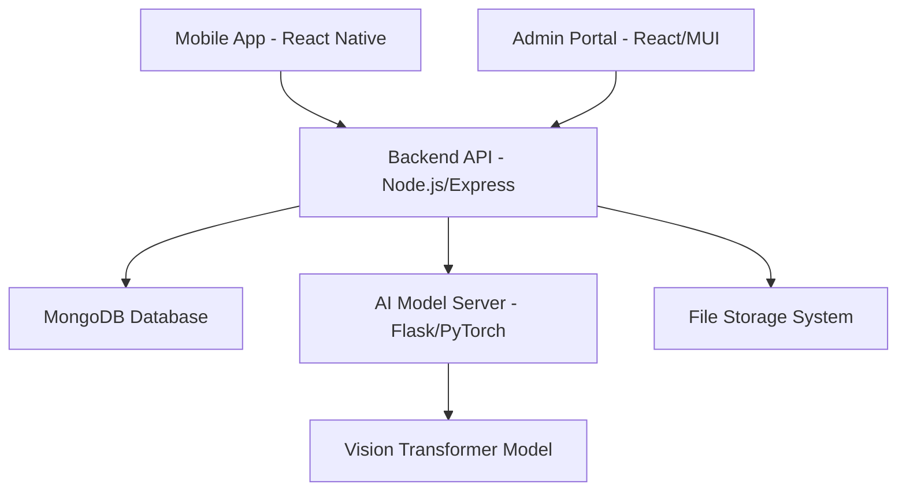

# SafeStreets - AI-Powered Road Damage Detection & Management System

## 🌟 Overview

SafeStreets is an innovative end-to-end solution that revolutionizes road maintenance operations through artificial intelligence and modern technology. The system combines mobile image capture, Vision Transformer (ViT) machine learning models, and intuitive management dashboards to streamline the entire process from damage detection to repair completion.

Field workers use a React Native mobile application to capture road damage images, which are automatically analyzed by a sophisticated AI model to classify damage types according to international standards. Administrators monitor operations through a comprehensive web dashboard built with React and Material-UI, enabling efficient task assignment, progress tracking, and data-driven decision making.

## 🏗️ System Architecture

The SafeStreets platform consists of five interconnected components:



### Core Components:

1. **📱 Mobile Application** - React Native app for field workers
2. **🧠 AI Model Server** - Flask-based Vision Transformer inference server  
3. **⚙️ Backend API** - Node.js/Express REST API with MongoDB
4. **🖥️ Admin Portal** - React-based web dashboard with Material-UI
5. **📊 Analytics Engine** - Real-time data processing and insights

## ✨ Key Features

### 📱 Mobile Application (React Native + Expo)

**Core Functionality:**
- **📷 Advanced Camera Integration** - High-quality image capture with Expo Camera
- **📍 GPS Auto-Tagging** - Automatic location embedding with Expo Location
- **🔄 Offline Synchronization** - AsyncStorage for offline data management
- **📊 Status Tracking** - Real-time report status monitoring
- **🎨 Modern UI/UX** - Material Design with React Native Paper
- **🔐 Secure Authentication** - JWT-based user authentication
- **🔔 Push Notifications** - Real-time updates and task assignments

**Technical Features:**
- Cross-platform compatibility (iOS/Android)
- Gesture-based navigation with React Navigation
- Animated transitions and feedback
- Error boundary implementation
- Network state management

### 🧠 AI-Powered Damage Detection (Vision Transformer)

**Classification System:**
- **D00** - Longitudinal cracks
- **D10** - Transverse cracks  
- **D20** - Alligator cracks
- **D30** - Potholes
- **D40** - Line cracks
- **D43** - Cross walk blur
- **D44** - Whiteline blur
- **D50** - Manhole covers

**AI Capabilities:**
- **📏 Severity Assessment** - Automated damage severity evaluation
- **🖼️ Image Annotation** - Bounding box generation for detected damages
- **⚡ Fast Inference** - Optimized PyTorch model serving
- **📈 Confidence Scoring** - Prediction confidence thresholds
- **🔄 Model Versioning** - Support for model updates and rollbacks

### ⚙️ Backend Infrastructure (Node.js + Express + MongoDB)

**API Services:**
- **🔐 Authentication System** - Admin and field worker management
- **📝 Report Management** - CRUD operations for damage reports
- **🖼️ Image Processing** - Multer-based file upload and storage
- **🤖 AI Integration** - Seamless communication with ML model server
- **📧 Email Automation** - Automated report notifications
- **📊 Analytics Engine** - Data aggregation and insights

**Database Models:**
- `Admin` - Administrative user management
- `FieldWorker` - Field worker profiles and assignments
- `DamageReport` - Comprehensive damage documentation
- `AiReport` - AI analysis results and metadata
- `Image` - File storage and image metadata

**Security Features:**
- JWT token authentication
- Role-based access control (RBAC)
- Input validation and sanitization
- CORS policy implementation
- Rate limiting protection

### 🖥️ Admin Portal (React + Material-UI)

**Dashboard Features:**
- **📊 Real-time Analytics** - Live damage statistics and trends
- **🗺️ Interactive Map View** - Leaflet-based damage visualization
- **📈 Advanced Charts** - MUI X-Charts for data visualization
- **📋 Report Management** - Comprehensive report filtering and sorting
- **👥 User Management** - Field worker and admin administration
- **🔧 Repair Task Assignment** - Workflow management and tracking
- **📱 Responsive Design** - Mobile-friendly interface

**Analytics Capabilities:**
- Damage type distribution analysis
- Geographic hotspot identification
- Repair completion rates
- Severity trend analysis
- Cost-benefit reporting
- Historical data comparison

**Administrative Tools:**
- Bulk operations support
- Advanced filtering options
- Data export functionality
- Report generation
- User role management
- System configuration

## 🛠️ Technology Stack

### Frontend Technologies
| Component | Technology | Version | Purpose |
|-----------|------------|---------|---------|
| **Admin Portal** | React.js | v18.2 | Web dashboard framework |
| **UI Library** | Material-UI (MUI) | v5.13 | Component library and design system |
| **Charts** | MUI X-Charts & Recharts | v8.5 | Data visualization |
| **Maps** | Leaflet | v1.9.4 | Interactive mapping |
| **Routing** | React Router DOM | v6.11 | SPA navigation |
| **Animation** | Framer Motion | v10.12 | UI animations |
| **HTTP Client** | Axios | v1.10 | API communication |

### Backend Technologies
| Component | Technology | Version | Purpose |
|-----------|------------|---------|---------|
| **Runtime** | Node.js | v14+ | Server-side JavaScript |
| **Framework** | Express.js | v5.1 | Web application framework |
| **Database** | MongoDB | v4+ | Document-based database |
| **ODM** | Mongoose | v8.13 | MongoDB object modeling |
| **Authentication** | JWT | v9.0 | Token-based authentication |
| **File Upload** | Multer | v1.4.5 | Multipart form handling |
| **Security** | bcryptjs | v3.0 | Password hashing |

### Mobile Technologies
| Component | Technology | Version | Purpose |
|-----------|------------|---------|---------|
| **Framework** | React Native | v0.79 | Cross-platform mobile development |
| **Platform** | Expo | v53.0 | Development and deployment platform |
| **Navigation** | React Navigation | v7.1 | Mobile navigation |
| **UI Library** | React Native Paper | v5.13 | Material Design components |
| **Camera** | Expo Camera | v16.1 | Camera integration |
| **Location** | Expo Location | v18.1 | GPS and location services |
| **Storage** | AsyncStorage | - | Local data persistence |

### AI/ML Technologies
| Component | Technology | Version | Purpose |
|-----------|------------|---------|---------|
| **Framework** | PyTorch | v2.0.1 | Deep learning framework |
| **Vision** | torchvision | v0.15.2 | Computer vision library |
| **Server** | Flask | v2.0.1 | ML model serving |
| **Image Processing** | OpenCV | v4.7.0 | Image preprocessing |
| **Data Analysis** | NumPy, Matplotlib | Latest | Data manipulation and visualization |

### Development & DevOps
| Component | Technology | Purpose |
|-----------|------------|---------|
| **Version Control** | Git | Source code management |
| **Package Manager** | npm/yarn | Dependency management |
| **Development** | Nodemon | Auto-restart development server |
| **Environment** | dotenv | Environment variable management |
| **CORS** | cors | Cross-origin resource sharing |

## 🚀 Quick Start Guide

### Prerequisites

Ensure you have the following installed on your system:

- **Node.js** (v14.x or higher) - [Download here](https://nodejs.org/)
- **MongoDB** (v4.x or higher) - [Installation guide](https://docs.mongodb.com/manual/installation/)
- **Python** (v3.8 or higher) - [Download here](https://python.org/)
- **Expo CLI** - Install with `npm install -g @expo/cli`
- **Git** - [Installation guide](https://git-scm.com/book/en/v2/Getting-Started-Installing-Git)

### 📦 Installation

#### 1. Clone the Repository
```bash
git clone https://github.com/your-username/safestreets.git
cd safestreets
```

#### 2. Backend Setup
```bash
# Navigate to backend directory
cd backend

# Install dependencies
npm install

# Create environment file
cp .env.example .env

# Configure your environment variables in .env:
# MONGODB_URI=mongodb://localhost:27017/safestreets
# JWT_SECRET=your-super-secret-jwt-key
# PORT=5000
# NODE_ENV=development

# Start MongoDB service (if not running)
# On macOS with Homebrew: brew services start mongodb-community
# On Linux: sudo systemctl start mongod
# On Windows: net start MongoDB

# Start the backend server
npm start
```

#### 3. Admin Portal Setup
```bash
# Open new terminal and navigate to admin portal
cd apps/admin-portal

# Install dependencies
npm install

# Start the development server
npm start

# Access the admin portal at http://localhost:3000
```

#### 4. Mobile App Setup
```bash
# Open new terminal and navigate to user app
cd apps/user-app

# Install dependencies
npm install

# Start the Expo development server
npx expo start

# Use Expo Go app to scan QR code or run on simulator
```

#### 5. AI Model Server Setup
```bash
# Open new terminal and navigate to model server
cd vit_model_server

# Create virtual environment
python -m venv .venv

# Activate virtual environment
# On macOS/Linux:
source .venv/bin/activate
# On Windows:
.venv\Scripts\activate

# Install Python dependencies
pip install -r requirements.txt

# Start the model server
python app.py

# Model server will be available at http://localhost:5001
```

### 🔧 Configuration

#### Backend Environment Variables
Create a `.env` file in the `backend` directory:

```env
# Database
MONGODB_URI=mongodb://localhost:27017/safestreets

# Authentication
JWT_SECRET=your-super-secret-jwt-key-make-it-long-and-random
JWT_EXPIRES_IN=7d

# Server
PORT=5000
NODE_ENV=development

# AI Model Server
AI_MODEL_URL=http://localhost:5001
```

#### Admin Portal Configuration
Update `apps/admin-portal/src/config/constants.js`:

```javascript
export const API_BASE_URL = 'http://localhost:5000/api';
export const AI_MODEL_URL = 'http://localhost:5001';
```

#### Mobile App Configuration
Update `apps/user-app/config.js`:

```javascript
export const API_BASE_URL = 'http://your-backend-ip:5000/api';
export const AI_MODEL_URL = 'http://your-ai-server-ip:5001';
```

### 🏃‍♂️ Running the System

#### Development Mode
```bash
# Terminal 1: Backend server
cd backend && npm start

# Terminal 2: Admin portal
cd apps/admin-portal && npm start

# Terminal 3: Mobile app
cd apps/user-app && npx expo start

# Terminal 4: AI model server
cd vit_model_server && python app.py
```

#### Using VS Code Tasks
If you're using VS Code, you can use the pre-configured task:

```bash
# Open Command Palette (Cmd+Shift+P / Ctrl+Shift+P)
# Type "Tasks: Run Task"
# Select "Run Backend"
```

### 🧪 Testing the Installation

1. **Backend API**: Visit `http://localhost:5000/health` - should return health status
2. **Admin Portal**: Visit `http://localhost:3000` - should load the login page
3. **AI Model Server**: Visit `http://localhost:5001/health` - should return AI server status
4. **Mobile App**: Scan QR code with Expo Go app

### 📱 Mobile App Installation

#### For iOS Simulator
```bash
cd apps/user-app
npx expo start --ios
```

#### For Android Emulator
```bash
cd apps/user-app
npx expo start --android
```

#### For Physical Device
1. Install Expo Go from App Store (iOS) or Google Play Store (Android)
2. Run `npx expo start` in the `apps/user-app` directory
3. Scan the QR code with your device camera (iOS) or Expo Go app (Android)

## 💡 Usage Guide

### 📱 Mobile Application Workflow

#### For Field Workers:

1. **🔐 Authentication**
   ```
   • Launch the SafeStreets mobile app
   • Log in with your field worker credentials
   • Complete profile setup if first-time user
   ```

2. **📷 Capturing Road Damage**
   ```
   • Navigate to "Camera" tab
   • Allow location and camera permissions
   • Point camera at road damage
   • Tap capture button - GPS coordinates auto-embedded
   • Add optional description or notes
   • Submit report for AI analysis
   ```

3. **📊 Tracking Reports**
   ```
   • View "Reports" tab for submission history
   • Monitor status: Pending → Processing → Analyzed → Assigned
   • Receive notifications for status updates
   • Access detailed analysis results
   ```

4. **🔧 Task Management**
   ```
   • Check "Tasks" tab for assigned repairs
   • View task details and priority levels
   • Update repair progress
   • Upload completion photos
   ```

### 🖥️ Admin Portal Workflow

#### For Administrators:

1. **🔐 Dashboard Access**
   ```
   • Navigate to http://localhost:3000
   • Log in with admin credentials
   • Access comprehensive dashboard overview
   ```

2. **📊 Monitoring Operations**
   ```
   • Dashboard: Real-time statistics and KPIs
   • Reports: Filter and sort damage reports
   • Map View: Geographic visualization of damages
   • Analytics: Trend analysis and insights
   ```

3. **🔧 Repair Management**
   ```
   • Review AI-analyzed damage reports
   • Assign tasks to field workers
   • Set priority levels and deadlines
   • Track repair progress and completion
   ```

4. **👥 User Administration**
   ```
   • Manage field worker accounts
   • Configure user roles and permissions
   • Monitor system usage statistics
   • Generate administrative reports
   ```

### 🤖 AI Model Integration

#### Automated Analysis Process:

1. **Image Reception**: Mobile app uploads image to backend
2. **AI Processing**: Backend forwards to ML model server
3. **Classification**: ViT model analyzes and classifies damage
4. **Results**: Classification results returned to backend
5. **Storage**: Results stored in MongoDB with metadata
6. **Notification**: Relevant stakeholders notified of results

#### Damage Classification Types:
- **D00**: Longitudinal cracks
- **D10**: Transverse cracks
- **D20**: Alligator cracks
- **D30**: Potholes
- **D40**: Line cracks
- **D43**: Cross walk blur
- **D44**: Whiteline blur
- **D50**: Manhole covers

## 🔌 API Documentation

### Authentication Endpoints

#### Admin Authentication
```http
POST /api/admin/auth/login
Content-Type: application/json

{
  "email": "admin@safestreets.com",
  "password": "securepassword"
}

Response:
{
  "success": true,
  "token": "eyJhbGciOiJIUzI1NiIsInR5cCI6IkpXVCJ9...",
  "user": {
    "id": "admin_id",
    "email": "admin@safestreets.com",
    "name": "Admin Name"
  }
}
```

#### Field Worker Authentication
```http
POST /api/field/auth/login
Content-Type: application/json

{
  "email": "worker@safestreets.com",
  "password": "workerpassword"
}
```

### Damage Report Endpoints

#### Submit New Damage Report
```http
POST /api/damage/report
Content-Type: multipart/form-data
Authorization: Bearer <jwt_token>

FormData:
- image: [file]
- location: {"latitude": 40.7128, "longitude": -74.0060}
- description: "Pothole on main street"
- severity: "high"
```

#### Get All Damage Reports
```http
GET /api/damage/reports?page=1&limit=10&status=analyzed
Authorization: Bearer <jwt_token>

Response:
{
  "success": true,
  "data": {
    "reports": [...],
    "pagination": {
      "page": 1,
      "limit": 10,
      "total": 50,
      "pages": 5
    }
  }
}
```

#### Get Specific Damage Report
```http
GET /api/damage/reports/:reportId
Authorization: Bearer <jwt_token>

Response:
{
  "success": true,
  "data": {
    "id": "report_id",
    "aiAnalysis": {
      "classification": "D30",
      "confidence": 0.95,
      "severity": "high"
    },
    "location": {...},
    "status": "analyzed",
    "createdAt": "2024-01-15T10:30:00Z"
  }
}
```

### Image Processing Endpoints

#### Upload Image for Analysis
```http
POST /api/images/upload
Content-Type: multipart/form-data
Authorization: Bearer <jwt_token>

FormData:
- image: [file]
- metadata: {"source": "mobile_app", "quality": "high"}
```

#### Get AI Analysis Results
```http
GET /api/images/:imageId/analysis
Authorization: Bearer <jwt_token>

Response:
{
  "success": true,
  "analysis": {
    "prediction": "D30",
    "confidence": 0.95,
    "annotated_image": "base64_encoded_image",
    "processing_time": 1.2
  }
}
```

### Analytics Endpoints

#### System Overview
```http
GET /api/analytics/overview
Authorization: Bearer <jwt_token>

Response:
{
  "totalReports": 1250,
  "pendingReports": 45,
  "completedRepairs": 1100,
  "averageRepairTime": "3.2 days",
  "topDamageTypes": ["D30", "D20", "D10"]
}
```

#### Geographic Hotspots
```http
GET /api/analytics/hotspots
Authorization: Bearer <jwt_token>

Response:
{
  "hotspots": [
    {
      "location": {"lat": 40.7128, "lng": -74.0060},
      "damageCount": 15,
      "severity": "high",
      "area": "Downtown District"
    }
  ]
}
```

### Error Response Format
```json
{
  "success": false,
  "error": {
    "code": "VALIDATION_ERROR",
    "message": "Invalid input data",
    "details": {
      "field": "email",
      "issue": "Invalid email format"
    }
  }
}
```

### Response Status Codes
- `200` - Success
- `201` - Created
- `400` - Bad Request
- `401` - Unauthorized
- `403` - Forbidden
- `404` - Not Found
- `500` - Internal Server Error

## 🧠 Machine Learning & AI

### Vision Transformer (ViT) Model

SafeStreets employs a state-of-the-art Vision Transformer model specifically trained for road damage detection and classification. The model follows international road damage classification standards.

#### Model Architecture
- **Base Model**: Vision Transformer (ViT-Base-16)
- **Input Resolution**: 224x224 pixels
- **Training Dataset**: Comprehensive road damage dataset with 8 damage classes
- **Framework**: PyTorch 2.0.1 with torchvision
- **Inference Server**: Flask-based REST API

#### Damage Classification System

| Class Code | Damage Type | Description | Typical Severity |
|------------|-------------|-------------|------------------|
| **D00** | Longitudinal Cracks | Linear cracks parallel to road direction | Low to Medium |
| **D10** | Transverse Cracks | Linear cracks perpendicular to road direction | Low to Medium |
| **D20** | Alligator Cracks | Interconnected cracks forming polygon patterns | Medium to High |
| **D30** | Potholes | Circular/oval depressions in road surface | High to Critical |
| **D40** | Line Cracks | General linear crack patterns | Low to Medium |
| **D43** | Cross Walk Blur | Faded/damaged crosswalk markings | Low to Medium |
| **D44** | Whiteline Blur | Faded/damaged lane markings | Low to Medium |
| **D50** | Manhole Covers | Damaged or displaced utility covers | Medium to High |

#### Model Performance
- **Accuracy**: 92%+ on validation dataset
- **Inference Time**: ~1.2 seconds per image
- **Confidence Threshold**: 0.85 for production deployment
- **Batch Processing**: Support for multiple image analysis

#### AI Model Server Features

**📁 Server Structure:**
```
vit_model_server/
├── app.py              # Flask application server
├── model.py            # ViT model definition
├── predict.py          # Prediction logic
├── train.py            # Model training scripts
├── dataset.py          # Data loading and preprocessing
├── utils.py            # Utility functions
├── requirements.txt    # Python dependencies
├── vit_model.pth      # Trained model weights
└── class_names.txt    # Class label mappings
```

**🔄 Processing Pipeline:**
1. **Image Reception**: Accept base64 encoded images via REST API
2. **Preprocessing**: Resize, normalize, and prepare for model input
3. **Inference**: Run through ViT model for classification
4. **Post-processing**: Apply confidence thresholds and annotation
5. **Response**: Return classification results with confidence scores

**🚀 API Endpoints:**
```python
# Health check
GET /health

# Image classification
POST /predict
{
  "image": "base64_encoded_image_string"
}

# Response format
{
  "prediction": "D30",
  "confidence": 0.95,
  "annotated_image": "base64_annotated_image",
  "processing_time": 1.2,
  "success": true
}
```

#### Research & Development

**📚 Jupyter Notebooks:**
- `image-classification-vit-pytorch.ipynb` - Model training and evaluation
- `vit_pytorch.ipynb` - ViT architecture exploration  
- `VIT&BERT-model.ipynb` - Multi-modal analysis experiments

**🔬 Research Papers:**
- Located in `docs/research-papers/`
- VIT-research_paper.pdf - Detailed methodology and results

#### Model Training Process

**📊 Dataset Preparation:**
```python
# Dataset structure
dataset/
├── train/
│   ├── images/  
│   ├── annotations/  

├── val/
└── test/
```

**🏋️ Training Configuration:**
- **Optimizer**: AdamW with learning rate scheduling
- **Loss Function**: CrossEntropyLoss with label smoothing
- **Data Augmentation**: Random rotation, scaling, color jittering
- **Regularization**: Dropout, weight decay
- **Epochs**: 15 with early stopping

## 🔐 Security & Authentication

### Security Architecture

SafeStreets implements a comprehensive security framework to protect sensitive infrastructure data and ensure secure operations.

#### Authentication System
- **🔑 JWT-based Authentication**: Stateless token-based system
- **🔐 Role-based Access Control (RBAC)**: Admin and field worker roles
- **🕐 Token Expiration**: Configurable expiration times (default: 7 days)
- **🔄 Refresh Token Support**: Seamless token renewal
- **🚫 Token Blacklisting**: Immediate token revocation capabilities

#### Data Protection
- **🔒 Password Security**: bcryptjs hashing with salt rounds
- **🛡️ Input Validation**: Comprehensive request sanitization
- **🚪 API Rate Limiting**: Protection against brute force attacks
- **🌐 CORS Configuration**: Secure cross-origin resource sharing
- **📁 File Upload Security**: Validated file types and size limits

#### Infrastructure Security
- **🔐 Environment Variables**: Sensitive configuration management
- **📊 MongoDB Security**: Connection string encryption
- **🌍 Network Security**: Production-ready deployment guidelines
- **📝 Audit Logging**: Comprehensive activity logging

#### Mobile App Security
- **📱 Secure Storage**: AsyncStorage with encryption
- **🔐 Biometric Authentication**: Optional fingerprint/face ID
- **📡 HTTPS Communication**: All API calls encrypted
- **🔄 Certificate Pinning**: Protection against MITM attacks

### Privacy & Compliance
- **📍 Location Data**: Encrypted GPS coordinates
- **🖼️ Image Processing**: On-device preprocessing options
- **🗑️ Data Retention**: Configurable retention policies
- **📋 GDPR Compliance**: Data subject rights implementation

## 🏗️ Project Structure

```
safestreets/
├── 📁 apps/                          # Application modules
│   ├── 📱 admin-portal/              # React web dashboard
│   │   ├── 📁 public/                # Static assets
│   │   ├── 📁 src/
│   │   │   ├── 📁 components/        # Reusable UI components
│   │   │   │   ├── 📁 analytics/     # Chart and graph components
│   │   │   │   ├── 📁 common/        # Shared components
│   │   │   │   ├── 📁 dashboard/     # Dashboard widgets
│   │   │   │   ├── 📁 layout/        # Layout components
│   │   │   │   └── 📁 reports/       # Report management
│   │   │   ├── 📁 pages/             # Route components
│   │   │   ├── 📁 hooks/             # Custom React hooks
│   │   │   ├── 📁 services/          # API service layer
│   │   │   └── 📁 utils/             # Utility functions
│   │   └── 📄 package.json           # Dependencies
│   │
│   └── 📱 user-app/                  # React Native mobile app
│       ├── 📁 screens/               # App screens
│       ├── 📁 assets/                # Images and icons
│       ├── 📄 App.js                 # Main app component
│       └── 📄 package.json           # Dependencies
│
├── ⚙️ backend/                       # Node.js REST API
│   ├── 📁 controllers/               # Route handlers
│   │   ├── 📄 adminAuthController.js
│   │   ├── 📄 damageController.js
│   │   ├── 📄 fieldWorkerController.js
│   │   └── 📄 ImageController.js
│   ├── 📁 middleware/                # Express middleware
│   ├── 📁 models/                    # MongoDB schemas
│   │   ├── 📄 Admin.js
│   │   ├── 📄 DamageReport.js
│   │   ├── 📄 FieldWorker.js
│   │   └── 📄 Image.js
│   ├── 📁 routes/                    # API route definitions
│   ├── 📁 utils/                     # Utility functions
│   ├── 📄 server.js                  # Express server
│   └── 📄 package.json               # Dependencies
│
├── 🧠 vit_model_server/              # AI model server
│   ├── 📄 app.py                     # Flask application
│   ├── 📄 model.py                   # ViT model definition
│   ├── 📄 predict.py                 # Inference logic
│   ├── 📄 train.py                   # Training scripts
│   ├── 📄 dataset.py                 # Data handling
│   ├── 📄 vit_model.pth             # Trained model weights
│   ├── 📄 requirements.txt           # Python dependencies
│   └── 📁 static/uploads/            # Uploaded images
│
├── 📚 notebooks/                     # Jupyter research notebooks
│   ├── 📄 VIT&BERT-model.ipynb      # Multi-modal experiments
│   ├── 📄 vit_pytorch.ipynb         # ViT implementation
│   └── 📄 image-classification-vit-pytorch.ipynb
│
├── 📖 docs/                          # Documentation
│   ├── 📄 features.md                # Feature specifications
│   ├── 📄 architecture.png          # System architecture
│   └── 📁 research-papers/          # Academic papers
│
└── 📄 README.md                      # This file
```

### Component Descriptions

#### 🖥️ Admin Portal (`apps/admin-portal/`)
- **Framework**: React 18.2 with Material-UI v5
- **Features**: Dashboard, analytics, map view, user management
- **State Management**: React hooks with context API
- **Routing**: React Router DOM v6
- **Charts**: MUI X-Charts and Recharts integration

#### 📱 Mobile App (`apps/user-app/`)
- **Framework**: React Native with Expo
- **Navigation**: React Navigation v7
- **Camera**: Expo Camera with image picker
- **Offline Support**: AsyncStorage for data persistence
- **UI**: React Native Paper with custom animations

#### ⚙️ Backend API (`backend/`)
- **Framework**: Express.js v5 with Node.js
- **Database**: MongoDB with Mongoose ODM
- **Authentication**: JWT with bcryptjs
- **File Handling**: Multer for image uploads
- **API Structure**: RESTful design with proper error handling

#### 🧠 AI Model Server (`vit_model_server/`)
- **Framework**: Flask with PyTorch
- **Model**: Vision Transformer (ViT) implementation
- **Processing**: OpenCV for image preprocessing
- **Deployment**: Production-ready Flask server

### Project Roadmap

#### 🎯 Upcoming Features
- [ ] Real-time notifications system
- [ ] Advanced analytics dashboard
- [ ] Multi-language support
- [ ] Offline mode for mobile app
- [ ] Machine learning model improvements
- [ ] Integration with GIS systems
- [ ] Advanced reporting features
- [ ] Role-based permissions system

#### 🔄 Current Priorities
- [ ] Performance optimization
- [ ] Security enhancements
- [ ] Mobile app stability
- [ ] AI model accuracy improvements
- [ ] Documentation updates

## 📞 Support & Contact

### Getting Help

- **📖 Documentation**: Check this README and `/docs` folder
- **🐛 Bug Reports**: Create an issue on GitHub
- **💡 Feature Requests**: Open a feature request issue
- **❓ Questions**: Use GitHub Discussions

### Contact Information

- **📧 Email**: safestreetsg408@gmail.com
- **🐙 GitHub**: [SafeStreets Repository](https://github.com/safestreets-g408/safestreets)
- **📂 Project Repository**: https://github.com/safestreets-g408/safestreets.git

### Community

- **💬 Discussions**: GitHub Discussions for Q&A
- **🐛 Issues**: GitHub Issues for bugs and features
- **📋 Project Board**: GitHub Projects for development tracking

---

<div align="center">
  
  **Made with ❤️ by the G408 Team**
  
  ⭐ Star this repository if you find it helpful!
  
</div>
