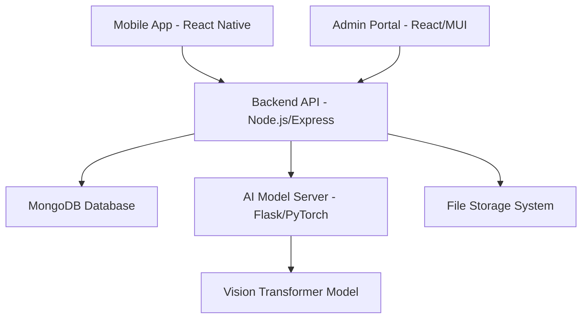

# SafeStreets - AI-Powered Road Damage Detection & Management System

## 🌟 Overview

SafeStreets is an innovative end-to-end solution that revolutionizes road maintenance operations through artificial intelligence and modern technology. The system combines mobile image capture, Vision Transformer (ViT) machine learning models, and intuitive management dashboards to streamline the entire process from damage detection to repair completion.

## 🏗️ System Architecture

The SafeStreets platform consists of five interconnected components:



### Core Components:

1. **📱 Mobile Application** - React Native app for field workers
2. **🧠 AI Model Server** - Flask-based Vision Transformer inference server  
3. **⚙️ Backend API** - Node.js/Express REST API with MongoDB
4. **🖥️ Admin Portal** - React-based web dashboard with Material-UI
5. **📊 Analytics Engine** - Real-time data processing and insights

## ✨ Key Features

- 📷 Advanced road damage detection using AI
- � Automatic GPS location tagging
- 🔐 Secure authentication for administrators and field workers
- 📊 Comprehensive analytics dashboard
- � Task assignment and tracking for repair teams
- � Cross-platform mobile app for field workers
- 🖥️ Feature-rich admin web portal
## 🛠️ Technology Stack

### Core Technologies
- **Frontend**: React.js, React Native, Material-UI, Expo
- **Backend**: Node.js, Express.js, MongoDB
- **AI/ML**: PyTorch, Vision Transformer (ViT), Flask
- **Authentication**: JWT, bcryptjs
- **DevOps**: Git, npm/yarn, Nodemon, dotenv

## 🚀 Quick Start Guide

### Prerequisites

- **Node.js** (v14.x or higher)
- **MongoDB** (v4.x or higher)
- **Python** (v3.8 or higher)
- **Expo CLI** - `npm install -g @expo/cli`

### 📦 Installation

1. Clone the repository and navigate to the project folder
2. Set up each component by following the detailed installation instructions in the [setup documentation](./docs/setup-guide.md)

### 🏃‍♂️ Running the System

#### Development Mode
```bash
# Terminal 1: Backend server
cd backend && npm start

# Terminal 2: Admin portal
cd apps/admin-portal && npm start

# Terminal 3: Mobile app
cd apps/user-app && npx expo start

# Terminal 4: AI model server
cd vit_model_server && python app.py
```

#### Using VS Code Tasks
```bash
# Open Command Palette (Cmd+Shift+P / Ctrl+Shift+P)
# Type "Tasks: Run Task"
# Select "Run Backend"
```

## 📚 Documentation

For detailed documentation on various aspects of the project, please refer to:

- [Setup Guide](./docs/setup-guide.md) - Detailed installation instructions
- [API Documentation](./docs/api-documentation.md) - API endpoints and usage
- [Mobile App Guide](./docs/mobile-app-guide.md) - Field worker app documentation
- [Admin Portal Guide](./docs/admin-portal-guide.md) - Admin dashboard documentation
- [AI Model Documentation](./docs/ai-model-documentation.md) - ML model details
- [Features Overview](./docs/features.md) - Comprehensive feature list
- [Field Worker Authentication](./docs/field-worker-auth.md) - Authentication system

## 🏗️ Project Structure

```
safestreets/
├── apps/                        # Frontend applications
│   ├── admin-portal/            # React admin dashboard
│   └── user-app/                # React Native mobile app
├── backend/                     # Node.js/Express API
├── vit_model_server/            # Flask AI model server
├── notebooks/                   # Research notebooks
├── docs/                        # Documentation
└── README.md                    # This file
```

For more detailed documentation on specific components, please refer to the documentation files in the `docs/` directory.

## 📞 Support & Contact

- **Email**: safestreetsg408@gmail.com
- **GitHub**: [SafeStreets Repository](https://github.com/safestreets-g408/safestreets)

---

<div align="center">
  
  **Made with ❤️ by the G408 Team**
  
  ⭐ Star this repository if you find it helpful!
  
</div>
